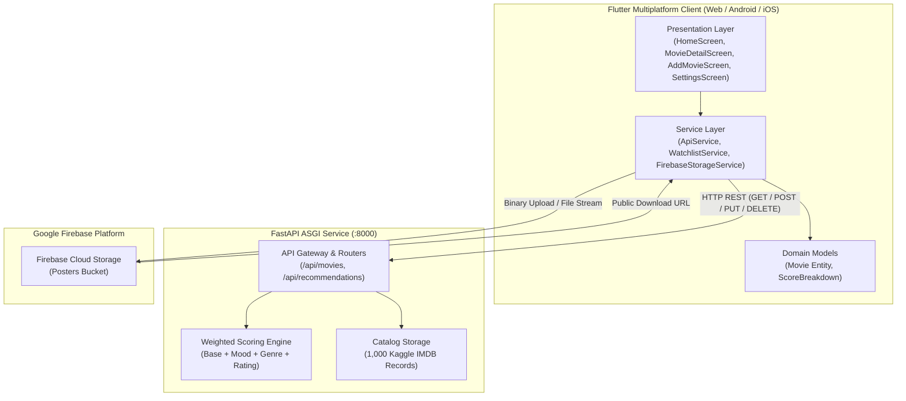

# CineMatch — Movie Recommendation System

[](https://flutter.dev)
[](https://dart.dev)
[](https://fastapi.tiangolo.com)
[](https://python.org)
[](https://firebase.google.com)
[](#)
[](#)

> **Practical 12**: *Develop and Deploy a Complete Flutter Application with a Backend API and Cloud Storage.*  
> CineMatch is an intelligent movie recommendation and exploration platform built with a high-performance **Flutter** frontend, an asynchronous **Python FastAPI** backend, and **Firebase Cloud Storage** for media uploads.

---

## Table of Contents

- [Overview & Features](#-overview--features)
- [System Architecture](#-system-architecture)
- [Recommendation Algorithm](#-recommendation-algorithm)
- [Project Structure](#-project-structure)
- [REST API Specification](#-rest-api-specification)
- [Quick Start Guide](#-quick-start-guide)
  - [1. Backend Setup (FastAPI)](#1-backend-setup-fastapi)
  - [2. Frontend Setup (Flutter)](#2-frontend-setup-flutter)
  - [3. Firebase Cloud Storage](#3-firebase-cloud-storage)
- [Testing & Quality Assurance](#-testing--quality-assurance)
- [Build & Deployment (Release APK)](#-build--deployment-release-apk)
- [Academic Attribution](#-academic-attribution)

---

## 🌟 Overview & Features

- **Mood & Genre Recommendation Engine**: Select from intuitive mood categories (`Action & Energy`, `Suspense & Thrill`, `Mind-Bending`, `Chill & Relaxed`, `Romantic`, `Inspiring`) and genres (`Action`, `Sci-Fi`, `Drama`, etc.) to generate personalized match scores.
- **Dual-Engine Architecture**: Operates with a live Python FastAPI server on `http://127.0.0.1:8000` and automatically switches to an in-app local offline engine if the server is unreachable.
- **Full CRUD Capabilities**:
  - **CREATE (POST)**: Add new movies with poster images, cast, director, runtime, and custom storyline.
  - **READ (GET)**: Browse 1,000 Kaggle IMDB movies with real-time search, sorting, and pagination.
  - **UPDATE (PUT)**: Edit existing ratings and synopses with live updates.
  - **DELETE (DELETE)**: Remove movies from the database with confirmation guards.
- **Firebase Cloud Storage Integration**:
  - Upload custom movie posters directly from device camera or photo gallery.
  - Live upload progress indicator and verified cloud poster badge.
- **Bespoke Obsidian & Vermilion Design System**:
  - Restrained dark editorial palette (Obsidian `#0C0E14`, Slate `#131722`, Vermilion `#E23D28`, Gold Star `#E8A838`).
  - Clear, natural English across all screens and dialogs.
  - Instant zero-latency loading with in-memory caching and pure CSS web splash screen.

---

## 🏗 System Architecture



---

## 🧮 Recommendation Algorithm

The recommendation engine calculates a normalized affinity score ($S_{norm} \in [72, 99]$) for each movie in the catalog:

$$S_{raw} = S_{base} + \Delta_{mood} + \Delta_{genre} + (Rating \times 2.0)$$

$$S_{norm} = \text{clamp}\left(\frac{S_{raw}}{142.0} \times 100.0, 72.0, 99.0\right)$$

- **$S_{base}$**: Inherent baseline score derived from IMDB ranking and global popularity.
- **$\Delta_{mood}$**: $+15.0$ bonus when the movie's mood matches the user's selected category.
- **$\Delta_{genre}$**: $+10.0$ bonus when the movie's genre tags intersect with the user's filter.
- **Rating Bonus**: Proportional boost scaled by critic and viewer review ratings.

---

## 📁 Project Structure

```
movie_recommed_sys/
├── backend/
│   ├── data/
│   │   └── full_movies.json          # 1,000 Kaggle IMDB movie records
│   ├── main.py                       # FastAPI REST endpoints & CORS configuration
│   ├── process_dataset.py            # Dataset cleaning & seed generator
│   └── requirements.txt              # Backend dependencies
├── lib/
│   ├── models/
│   │   └── movie.dart                # Movie data entity & JSON serialization
│   ├── screens/
│   │   ├── add_movie_screen.dart     # Form to create movie & upload poster to Firebase
│   │   ├── home_screen.dart          # Tabbed feed: Recommended, All Movies, Watchlist
│   │   ├── movie_detail_screen.dart  # Movie details, trailer, edit (PUT), delete (DELETE)
│   │   └── settings_screen.dart      # Server endpoint configuration & diagnostic tools
│   ├── services/
│   │   ├── api_service.dart          # Unified HTTP client with instant offline fallback
│   │   ├── firebase_storage_service.dart # Cloud storage uploader & progress tracker
│   │   └── watchlist_service.dart    # In-memory reactive bookmark manager
│   ├── theme/
│   │   └── app_theme.dart            # Obsidian & Vermilion design system tokens
│   ├── widgets/
│   │   ├── movie_card.dart           # Hover-animated movie poster card
│   │   ├── poster_image.dart         # Optimized image loader with monogram fallback
│   │   └── recommendation_chips.dart # Mood and genre selection carousel
│   ├── firebase_options.dart         # Firebase multiplatform configuration
│   └── main.dart                     # App entry point with instant background boot
├── test/
│   └── widget_test.dart              # Automated unit and widget test suite
├── web/
│   └── index.html                    # Web container with instant CSS splash animation
├── assets/data/
│   └── movies_seed.json              # Packaged offline movie seed data
├── requirements.txt                  # Root Python requirements
└── pubspec.yaml                      # Flutter dependencies and assets declaration
```

---

## 📡 REST API Specification

The FastAPI backend runs on `http://127.0.0.1:8000` and provides interactive Swagger documentation at `http://127.0.0.1:8000/docs`.

| Method | Endpoint | Query Parameters | Description |
|---|---|---|---|
| `GET` | `/api/health` | — | Returns service status, version, and movie count. |
| `GET` | `/api/movies` | `search`, `genre`, `min_rating`, `skip`, `limit` | Paginated catalog query with filtering and search. |
| `GET` | `/api/movies/{id}` | — | Fetch single movie details by unique ID. |
| `GET` | `/api/recommendations` | `mood`, `genre`, `limit` | Top recommended movies ranked by affinity score. |
| `POST` | `/api/movies` | *JSON Body* | Add a new movie record (`201 Created`). |
| `PUT` | `/api/movies/{id}` | *JSON Body (`rating`, `synopsis`)* | Update movie details (`200 OK`). |
| `DELETE` | `/api/movies/{id}` | — | Delete movie from database (`200 OK`). |
| `POST` | `/api/movies/reset` | — | Reset database back to original 1,000 Kaggle records. |

---

## 🚀 Quick Start Guide

### Prerequisites
- **Flutter SDK**: 3.22.0 or later ([flutter.dev](https://flutter.dev))
- **Python**: 3.10 or later ([python.org](https://python.org))
- **Google Chrome** (for web) or **Android Studio / Physical Device** (for mobile)

---

### 1. Backend Setup (FastAPI)

1. Open a terminal in the project root:
   ```bash
   pip install -r requirements.txt
   ```
2. Start the FastAPI backend:
   ```bash
   python backend/main.py
   ```
   *Or with Uvicorn directly:*
   ```bash
   uvicorn backend.main:app --host 127.0.0.1 --port 8000 --reload
   ```
3. Verify the server is running:
   - Interactive Docs (Swagger UI): [http://127.0.0.1:8000/docs](http://127.0.0.1:8000/docs)
   - Health Endpoint: [http://127.0.0.1:8000/api/health](http://127.0.0.1:8000/api/health)

---

### 2. Frontend Setup (Flutter)

1. Install project dependencies:
   ```bash
   flutter pub get
   ```
2. Run on Google Chrome:
   ```bash
   flutter run -d chrome
   ```
3. Run on Android Emulator / Connected Device:
   ```bash
   flutter run -d android
   ```
   > **Note for Android Emulator**: The app automatically provides a quick-switch preset to `http://10.0.2.2:8000` in **Settings** to connect to localhost on host machine.

---

### 3. Firebase Cloud Storage

1. Create a Firebase project in the [Firebase Console](https://console.firebase.google.com/).
2. Enable **Cloud Storage** under the Build menu.
3. Configure Storage Security Rules for testing:
   ```javascript
   rules_version = '2';
   service firebase.storage {
     match /b/{bucket}/o {
       match /{allPaths=**} {
         allow read, write: if true;
       }
     }
   }
   ```
4. In the app: Navigate to **+ ADD MOVIE**, pick an image from your device, and click **UPLOAD TO FIREBASE** to monitor the live upload progress.

---

## 🧪 Testing & Quality Assurance

Run the automated analyzer to verify zero static analysis errors:
```bash
flutter analyze
```
*Output: `No issues found! (ran in 1.7s)`*

Execute the automated test suite:
```bash
flutter test
```
*Output:*
```
00:01 +0: CineMatch app smoke test
00:01 +1: Movie model serialization and formattedRuntime test
00:01 +2: MovieCard and PosterImage widget test
00:01 +3: All tests passed!
```

---

## 📦 Build & Deployment (Release APK)

To compile the release APK for examination, demonstration, or production installation:

```bash
flutter build apk --release
```

The compiled release package will be located at:
```
build/app/outputs/flutter-apk/app-release.apk
```

To compile an optimized production web build:
```bash
flutter build web --release
```

---

## 🎓 Academic Attribution

- **Course**: Wireless & Mobile Applications (WMA)
- **Assignment**: Practical 12 — Develop and Deploy a Complete Flutter Application with a Backend API and Cloud Storage.
- **Dataset**: Kaggle IMDB 1,000 Movies Dataset (`yusufdelikkaya/imdb-movie-dataset`).
- **License**: MIT Open Source License.
