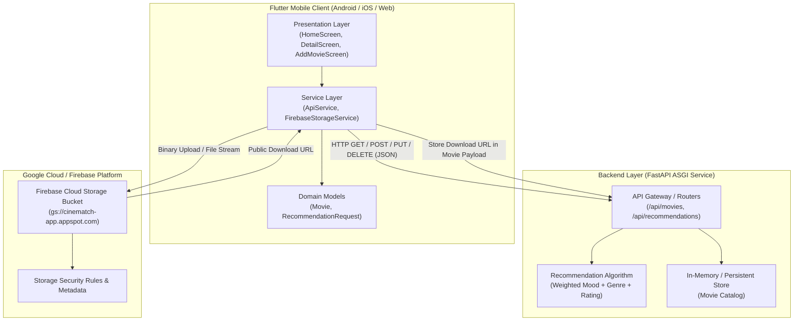

# CineMatch: System Architecture Document
**Practical 12: Develop and Deploy a Complete Flutter App with Backend API and Firebase Storage**

---

## 1. System Overview & Aim
The objective of this project is to architect, develop, integrate, and deploy a production-grade **Flutter Mobile Application** interfaced with an **Asynchronous REST API (FastAPI)** and **Firebase Cloud Storage**.

The application implements an intelligent **Movie Recommendation System & Review Vault (CineMatch)**:
1. **Frontend (Flutter)**: Cross-platform mobile UI providing dynamic content discovery, mood-based recommendations, movie catalog exploration, and cloud media uploading.
2. **Backend (REST API)**: High-performance Python FastAPI service exposing CRUD endpoints and a content-based recommendation algorithm with weighted scoring.
3. **Cloud Storage (Firebase Storage)**: Object storage for high-resolution movie posters, user review attachments, and assets with authenticated upload pipelines.

---

## 2. High-Level System Architecture



---

## 3. Flutter Clean Architecture Layers

```
lib/
├── models/
│   └── movie.dart                  # Data Entity & JSON Serialization
├── services/
│   ├── api_service.dart            # REST API Client (GET, POST, PUT, DELETE)
│   └── firebase_storage_service.dart# Firebase Storage Upload & URL Resolver
├── widgets/
│   ├── movie_card.dart             # Reusable Poster & Rating Card
│   └── recommendation_chips.dart   # Mood & Genre Selection Chips
├── screens/
│   ├── home_screen.dart            # Catalog & Recommendation Feed
│   ├── movie_detail_screen.dart    # Full Details, PUT Edit, DELETE Actions
│   ├── add_movie_screen.dart       # Poster Picker, Storage Upload & POST API
│   └── settings_screen.dart        # API Ping, Offline Toggle & Firebase Diagnostics
└── main.dart                       # Entry point, Theme & Firebase Init
```

### 3.1 Presentation Layer
- **`HomeScreen`**: Provides a dual discovery mode: **AI Recommendations** (filtered by mood & genre) and **All Movies** (catalog query with live search).
- **`MovieDetailScreen`**: Displays complete metadata, synopsis, and cloud storage provenance, with action triggers for `PUT` (edit) and `DELETE` (removal).
- **`AddMovieScreen`**: A multi-step form integrating `image_picker` to select media, stream it to Firebase Storage with a live progress bar, and bundle the resulting URL into the `POST` request.
- **`SettingsScreen`**: Environment switcher allowing easy transitions between Android Emulator (`10.0.2.2:8000`), Localhost (`127.0.0.1:8000`), or custom LAN server.

### 3.2 Service Layer
- **`ApiService`**: Encapsulates all networking using Dart's `http` package, handling connection timeouts, JSON encoding/decoding, and status code verification.
- **`FirebaseStorageService`**: Interacts with the Firebase Cloud Storage SDK (`firebase_storage`), uploading files with custom MIME metadata and retrieving secure download tokens.

---

## 4. REST API Specification

### 4.1 Endpoints Summary
| Method | Endpoint | Description | Status Code |
| :--- | :--- | :--- | :--- |
| `GET` | `/api/health` | Service health status check | `200 OK` |
| `GET` | `/api/movies` | Retrieve all movies (supports `genre`, `search`, `min_rating`) | `200 OK` |
| `GET` | `/api/movies/{id}` | Retrieve specific movie by unique ID | `200 OK` / `404 Not Found` |
| `GET` | `/api/recommendations` | Get ranked movies based on mood & genre query | `200 OK` |
| `POST` | `/api/movies` | Add a new movie review with cloud poster URL | `201 Created` |
| `PUT` | `/api/movies/{id}` | Update movie rating or synopsis | `200 OK` / `404 Not Found` |
| `DELETE` | `/api/movies/{id}` | Remove movie from database | `200 OK` / `404 Not Found` |
| `POST` | `/api/movies/reset`| Reset catalog to default seed dataset | `200 OK` |

### 4.2 Recommendation Algorithm Logic
The recommendation score ($S$) is calculated as follows:
$$S = S_{base} + \Delta_{mood} + \Delta_{genre} + (R \times 2.0)$$
Where:
- $S_{base} \in [80, 100]$: Baseline movie quality score.
- $\Delta_{mood} = 15.0$: Score bonus if movie matches user's current mood.
- $\Delta_{genre} = 10.0$: Score bonus if movie matches user's selected genre.
- $R \in [0.0, 10.0]$: User/critic rating.

---

## 5. Firebase Cloud Storage Integration

### 5.1 Storage Hierarchy
```
cinematch-app.appspot.com/
└── movie_posters/
    └── {timestamp}_{sanitized_file_name}.jpg
```

### 5.2 Upload Lifecycle
1. User selects image via `image_picker` (Gallery or Camera).
2. Image bytes are read and passed to `FirebaseStorage.instance.ref()`.
3. `UploadTask` emits progress events to update the UI progress bar.
4. On task completion, `.getDownloadURL()` retrieves the public CDN URL.
5. The URL is attached to the movie entity and persisted via the REST API.

### 5.3 Firebase Storage Security Rules
```javascript
rules_version = '2';
service firebase.storage {
  match /b/{bucket}/o {
    match /movie_posters/{allPaths=**} {
      // Allow read access to all users
      allow read: if true;
      // Allow image uploads under 5MB with image contentType
      allow write: if request.resource.size < 5 * 1024 * 1024
                   && request.resource.contentType.matches('image/.*');
    }
  }
}
```

---

## 6. Build and Deployment Pipeline

### 6.1 Flutter Release Build (Android APK)
To produce an optimized, signed release APK for demonstration and deployment:
```bash
# 1. Clean build artifacts
flutter clean

# 2. Get dependencies
flutter pub get

# 3. Build standalone Release APK
flutter build apk --release --split-per-abi
```
The resulting APK is generated at:
`build/app/outputs/flutter-apk/app-arm64-v8a-release.apk`

### 6.2 Backend Deployment
The FastAPI service can be run locally or deployed inside a Docker container:
```bash
# Local development
uvicorn backend.main:app --host 0.0.0.0 --port 8000 --reload

# Production Docker command
docker build -t cinematch-api .
docker run -d -p 8000:8000 cinematch-api
```
