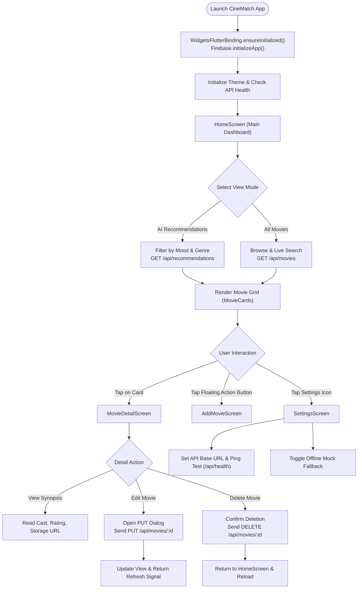
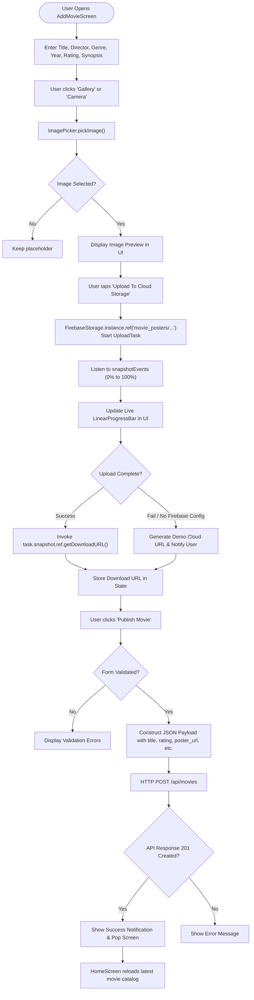
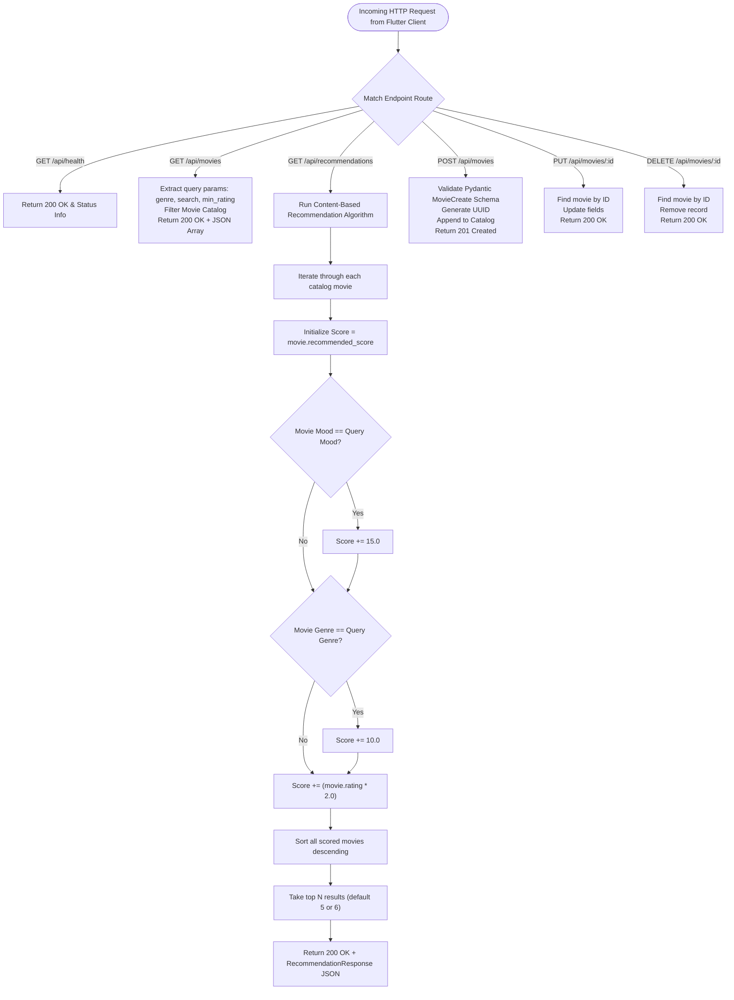
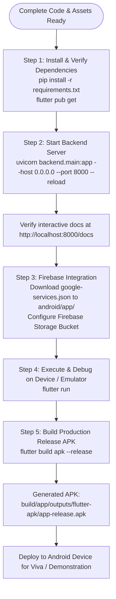

# CineMatch: Application Flowcharts
**Practical 12: Develop and Deploy a Complete Flutter App with Backend API and Firebase Storage**

---

## 1. Overall Application Navigation Flowchart

---

## 2. Firebase Cloud Storage Upload & Add Movie Flowchart

---

## 3. Backend REST API & Recommendation Engine Flowchart

---

## 4. Build, Packaging & Deployment Flowchart

